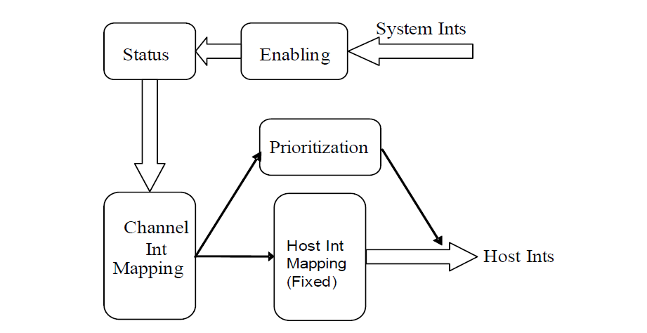
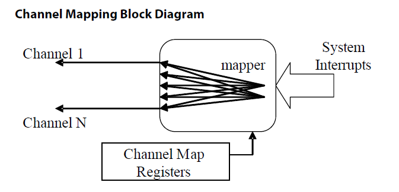
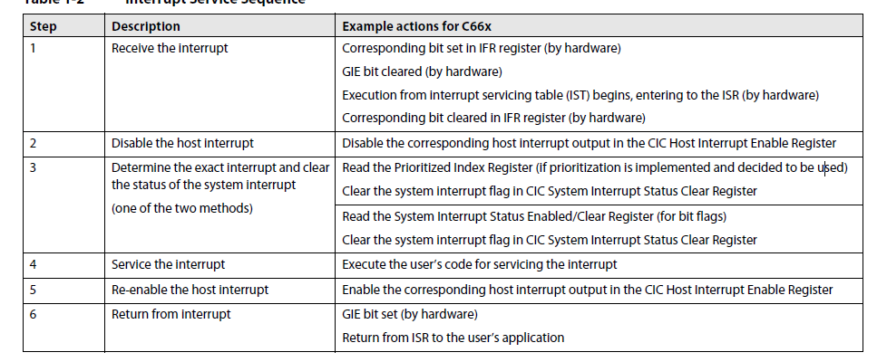

# 目录
- [片上CIC](#片上cic)
    - [中断流程](#中断流程)
    - [中断优先级](#中断优先级)
    - [中断服务流程](#中断优先级)
- [COREPAC_INTC](#corepac_intc)

# 片上CIC

## 中断流程
芯片级的中断，来源于片上许多外设，然后经过以下步骤被送到COREPAC，
 
- 使能  每个中断都有其使能位，未经使能的中断无法进入
- 中断状态  分为中断使能前状态和后状态，通过软件置位可以进行触发
- 通道映射 &emsp; 由于片上系统级外设众多，需要将其收缩，通过将每个中断映射到指定通道做或的关系，**注意：单个中断无法映射到多个通道**
  
- 主机中断映射 &emsp; 通道和主机中断间为一一对应的关系，每个通道通过一个寄存器来控制其映射,只读固定。

## 中断优先级
中断优先级分为两个部分，即通道内中断优先级和主机优先级
- 通道内中断优先级
&emsp; &emsp; 通道内中断优先级代表，在一个通道内，多个中断触发时，哪个中断的优先级高，CIC内，序号越低，代表优先级越高，可以通过`Host Interrupt Prioritized IndexRegister`进行查询。
- 主机中断优先级
&emsp; &emsp; 主机中断优先级取决于通道的序号，最低序号通道所隐射的主机中断拥有最高优先级。
**可以通过读`Host Interrupt Prioritized IndexRegister`来决定执行哪个服务程序，或者读中断状态寄存器进行服务程序选择**
## 中断服务流程
  

# COREPAC_INTC
